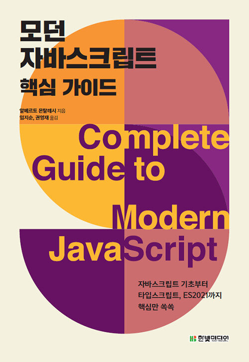

# README

도서 ''모던 자바스크립트 핵심 가이드''를 공부하고, 정리한 내용을 올리는 폴더입니다.

 

 

### 목차

1. <a href="https://github.com/1seul357/TIL/blob/master/JavaScript/%EB%AA%A8%EB%8D%98%20%EC%9E%90%EB%B0%94%EC%8A%A4%ED%81%AC%EB%A6%BD%ED%8A%B8%20%ED%95%B5%EC%8B%AC%20%EA%B0%80%EC%9D%B4%EB%93%9C/%EC%9E%90%EB%B0%94%EC%8A%A4%ED%81%AC%EB%A6%BD%ED%8A%B8%20%EA%B8%B0%EC%B4%88.md">자바스크립트 기초</a>
2. <a href="https://github.com/1seul357/TIL/blob/master/JavaScript/%EB%AA%A8%EB%8D%98%20%EC%9E%90%EB%B0%94%EC%8A%A4%ED%81%AC%EB%A6%BD%ED%8A%B8%20%ED%95%B5%EC%8B%AC%20%EA%B0%80%EC%9D%B4%EB%93%9C/%EC%8A%A4%EC%BD%94%ED%94%84%20(Scope).md">스코프</a>
3. <a href="https://github.com/1seul357/TIL/blob/master/JavaScript/%EB%AA%A8%EB%8D%98%20%EC%9E%90%EB%B0%94%EC%8A%A4%ED%81%AC%EB%A6%BD%ED%8A%B8%20%ED%95%B5%EC%8B%AC%20%EA%B0%80%EC%9D%B4%EB%93%9C/%ED%99%94%EC%82%B4%ED%91%9C%20%ED%95%A8%EC%88%98.md">화살표 함수</a>
4. <a href="https://github.com/1seul357/TIL/blob/master/JavaScript/%EB%AA%A8%EB%8D%98%20%EC%9E%90%EB%B0%94%EC%8A%A4%ED%81%AC%EB%A6%BD%ED%8A%B8%20%ED%95%B5%EC%8B%AC%20%EA%B0%80%EC%9D%B4%EB%93%9C/%ED%85%9C%ED%94%8C%EB%A6%BF%20%EB%A6%AC%ED%84%B0%EB%9F%B4.md">템플릿 리터럴</a>
5. <a href="https://github.com/1seul357/TIL/blob/master/JavaScript/%EB%AA%A8%EB%8D%98%20%EC%9E%90%EB%B0%94%EC%8A%A4%ED%81%AC%EB%A6%BD%ED%8A%B8%20%ED%95%B5%EC%8B%AC%20%EA%B0%80%EC%9D%B4%EB%93%9C/%EB%94%94%EC%8A%A4%ED%8A%B8%EB%9F%AD%EC%B2%98%EB%A7%81.md">디스트럭처링</a>
6. <a href="https://github.com/1seul357/TIL/blob/master/JavaScript/%EB%AA%A8%EB%8D%98%20%EC%9E%90%EB%B0%94%EC%8A%A4%ED%81%AC%EB%A6%BD%ED%8A%B8%20%ED%95%B5%EC%8B%AC%20%EA%B0%80%EC%9D%B4%EB%93%9C/%EB%AC%B8%EC%9E%90%EC%97%B4%20%EB%A9%94%EC%84%9C%EB%93%9C.md">문자열 메서드</a>
7. <a href="https://github.com/1seul357/TIL/blob/master/JavaScript/%EB%AA%A8%EB%8D%98%20%EC%9E%90%EB%B0%94%EC%8A%A4%ED%81%AC%EB%A6%BD%ED%8A%B8%20%ED%95%B5%EC%8B%AC%20%EA%B0%80%EC%9D%B4%EB%93%9C/%EB%A3%A8%ED%94%84.md">루프</a>
8. <a href="https://github.com/1seul357/TIL/blob/master/JavaScript/%EB%AA%A8%EB%8D%98%20%EC%9E%90%EB%B0%94%EC%8A%A4%ED%81%AC%EB%A6%BD%ED%8A%B8%20%ED%95%B5%EC%8B%AC%20%EA%B0%80%EC%9D%B4%EB%93%9C/%EB%B0%B0%EC%97%B4%20%EB%A9%94%EC%84%9C%EB%93%9C.md">배열 메서드</a>
9. <a href="https://github.com/1seul357/TIL/blob/master/JavaScript/%EB%AA%A8%EB%8D%98%20%EC%9E%90%EB%B0%94%EC%8A%A4%ED%81%AC%EB%A6%BD%ED%8A%B8%20%ED%95%B5%EC%8B%AC%20%EA%B0%80%EC%9D%B4%EB%93%9C/%EC%8A%A4%ED%94%84%EB%A0%88%EB%93%9C%20%EC%97%B0%EC%82%B0%EC%9E%90%EC%99%80%20%EB%A0%88%EC%8A%A4%ED%8A%B8%20%EB%A7%A4%EA%B0%9C%EB%B3%80%EC%88%98.md">스프레드 연산자와 레스트 매개변수</a>
10. <a href="https://github.com/1seul357/TIL/blob/master/JavaScript/%EB%AA%A8%EB%8D%98%20%EC%9E%90%EB%B0%94%EC%8A%A4%ED%81%AC%EB%A6%BD%ED%8A%B8%20%ED%95%B5%EC%8B%AC%20%EA%B0%80%EC%9D%B4%EB%93%9C/%EA%B0%9D%EC%B2%B4%20%EB%A6%AC%ED%84%B0%EB%9F%B4.md">객체 리터럴</a>
